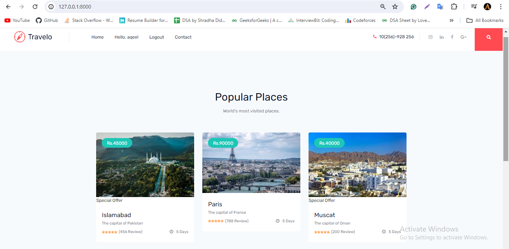

# travello app (django & postgresql)


To run this locally, run these commands:
```html
git clone https://github.com/aqeeladil/travello-demo-app.git
```

```html
cd core
```
<be>

Now run this command below and open http://127.0.0.1:8000/ in your browser to view this project

```html
python3 manage.py runserver
```
<br><br>
**Here is a quick image display for the whole application**




